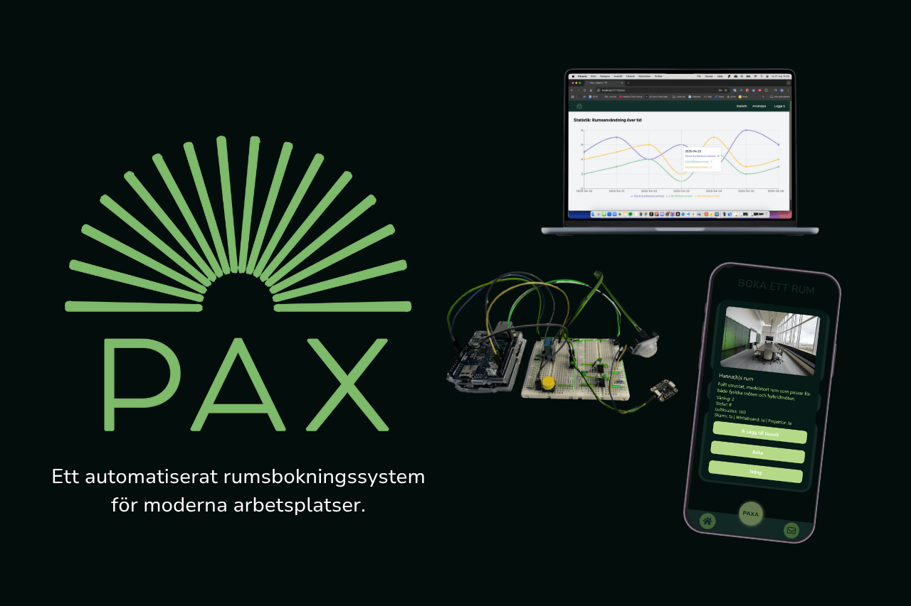

# PAX

## Team: Kusten är klar - Chas Challenge 2025

PAX är ett automatiserat rumsbokningssystem som förenklar vardagen på kontoret. Via en mobilapp kan medarbetare boka, se och hantera sina rumsbokningar, medan administratörer får full kontroll via en webbaserad dashboard. Systemet använder sensorer för att upptäcka närvaro i rummen och kan automatiskt boka eller avboka rum baserat på faktisk användning. PAX sparar tid och resurser, ökar tillgängligheten av rum och bidrar till ett smartare och mer hållbart kontorsflöde.

### [FMWx24 (Frontend repo)](https://github.com/Kusten-ar-klar-Chas-Challenge-2025/pax/tree/main/pax-mobile)
### [SUVx24 (IoT repo)](https://github.com/Kusten-ar-klar-Chas-Challenge-2025/pax/tree/main/Iot)
### [FJSx24 (Backend repo)](https://github.com/alicegmn/paxdb)

### [Backend/API deployad URL](https://paxdb.vercel.app/)

### [Front-end EAS (Expo Application Services) Android](https://expo.dev/artifacts/eas/qwP19Wj2vpnJuYwJq1Vrcj.apk)
### [Front-end EAS (Expo Application Services) Ios](https://expo.dev/artifacts/eas/atmUj6ae1mTqANcXLNi1Z1.tar.gz)
